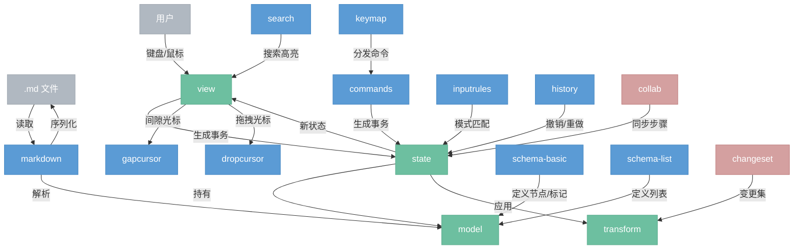

# 整体架构

> md-editor 是一个桌面 Markdown 编辑器，基于 ProseMirror 移植构建，使用 Rust + iced 实现。逐仓库移植 ProseMirror 的核心逻辑，视图层从 DOM 重写为 iced Canvas + cosmic-text。

## 总览



---

## 模块

按 ProseMirror 仓库一一对应，每个模块一篇文档。

### 核心

| 模块 | ProseMirror 仓库 | 说明 | 移植方式 |
|------|------------------|------|----------|
| model | prosemirror-model | 文档模型：Node、Fragment、Mark、Slice、Schema | 直接移植 |
| transform | prosemirror-transform | 变换：Step、StepMap、Mapping、Transform | 直接移植 |
| state | prosemirror-state | 状态：EditorState、Transaction、Selection、Plugin | 直接移植 |
| view | prosemirror-view | 视图：渲染、事件处理、装饰器 | **重写**（DOM → iced Canvas + cosmic-text） |

### 功能模块

| 模块 | ProseMirror 仓库 | 说明 | 移植方式 |
|------|------------------|------|----------|
| commands | prosemirror-commands | 编辑命令（toggle_bold、split_block 等） | 直接移植 |
| history | prosemirror-history | 撤销/重做 | 直接移植 |
| keymap | prosemirror-keymap | 快捷键映射 | 直接移植 |
| inputrules | prosemirror-inputrules | 输入规则（`## ` → 标题） | 直接移植 |
| gapcursor | prosemirror-gapcursor | 间隙光标 | 直接移植 |
| dropcursor | prosemirror-dropcursor | 拖拽放置光标 | 直接移植 |
| search | prosemirror-search | 搜索/替换 | 直接移植 |

### Schema

| 模块 | ProseMirror 仓库 | 说明 | 移植方式 |
|------|------------------|------|----------|
| schema-basic | prosemirror-schema-basic | 基础节点和标记定义 | 直接移植 |
| schema-list | prosemirror-schema-list | 列表节点和命令 | 直接移植 |

### Markdown

| 模块 | ProseMirror 仓库 | 说明 | 移植方式 |
|------|------------------|------|----------|
| markdown | prosemirror-markdown | Markdown 解析器/序列化器 | 直接移植 |

### 未来

| 模块 | ProseMirror 仓库 | 说明 | 移植方式 |
|------|------------------|------|----------|
| collab | prosemirror-collab | 协同编辑 | 暂不实现 |
| changeset | prosemirror-changeset | 变更集 | 暂不实现 |

---

## 渲染策略

不使用 iced widget 树渲染文档内容。节点树本身已经描述了完整的文档结构，再转换为 widget 树是多余的中间表示。

采用单个 iced Canvas + cosmic-text 直接渲染：

```
节点树 → 遍历 → cosmic-text Buffer（字体、样式、颜色）→ iced Canvas 绘制
```

视口裁剪天然容易实现（只绘制可见行）。光标定位、选区绘制、块级布局在 Canvas 层自行处理。

这是与 ProseMirror 原版最大的差异——原版基于 DOM/contenteditable，我们基于 Canvas 自绘。

---

## 实施阶段

### 第一阶段：核心移植

移植纯逻辑模块，不涉及渲染。完成后拥有完整的文档模型和编辑能力，但没有界面。

```
model → transform → state
```

可以通过单元测试验证正确性（构造文档、应用事务、检查结果）。

### 第二阶段：渲染实现

实现 view 层，将节点树渲染到 iced Canvas 上。完成后拥有可用的编辑器。

```
view（Canvas + cosmic-text）+ commands + keymap + history + inputrules
```

这是工作量最大的阶段，需要实现：
- 节点树 → cosmic-text 排版
- 光标和选区绘制
- 键盘/鼠标事件处理
- 坐标转换（屏幕坐标 ↔ 文档位置）
- IME 输入法处理
- 滚动和视口管理

### 第三阶段：全部移植

移植剩余功能模块，完善编辑体验。

```
gapcursor + dropcursor + search + markdown + schema-basic + schema-list
```

---

## 数据流

**正常编辑：**
```
用户输入
  ↓
keymap / inputrules → commands → 事务（步骤序列 + 映射器）
  ↓
state.apply(事务) → 新编辑器状态
  ↓
各插件状态更新（含 history 入栈）
  ↓
view 重新渲染（Canvas + cosmic-text）
```

**撤销：**
```
Ctrl+Z
  ↓
history → 取出逆向步骤 → 构造新事务
  ↓
state.apply → 正常流程
```

**文件读写：**
```
打开文件 → markdown.parse(字符串) → 节点树 → EditorState::create
保存文件 → markdown.serialize(节点树) → 字符串 → 写入 .md
```

---

## 与 ProseMirror 仓库对应

| ProseMirror 仓库 | md-editor 模块 | 阶段 | 备注 |
|------------------|---------------|------|------|
| prosemirror-model | model | 一 | 直接移植 |
| prosemirror-transform | transform | 一 | 直接移植 |
| prosemirror-state | state | 一 | 直接移植，含 Plugin/Selection |
| prosemirror-view | view | 二 | 重写为 Canvas + cosmic-text |
| prosemirror-commands | commands | 二 | 直接移植 |
| prosemirror-history | history | 二 | 直接移植 |
| prosemirror-keymap | keymap | 二 | 直接移植 |
| prosemirror-inputrules | inputrules | 二 | 直接移植 |
| prosemirror-gapcursor | gapcursor | 三 | 直接移植 |
| prosemirror-dropcursor | dropcursor | 三 | 直接移植 |
| prosemirror-search | search | 三 | 直接移植 |
| prosemirror-markdown | markdown | 三 | 直接移植 |
| prosemirror-schema-basic | schema-basic | 三 | 直接移植 |
| prosemirror-schema-list | schema-list | 三 | 直接移植 |
| prosemirror-collab | collab | — | 暂不实现 |
| prosemirror-changeset | changeset | — | 暂不实现 |
| prosemirror-menu | — | — | 不需要，用 iced 原生 UI |
| prosemirror-schema-table | schema-table | — | 按需，表格 schema 定义 |
| prosemirror-tables | tables | — | 按需，表格编辑功能 |
| prosemirror-test-builder | — | — | 测试工具，按需 |
| prosemirror-example-setup | — | — | 示例，不移植 |
