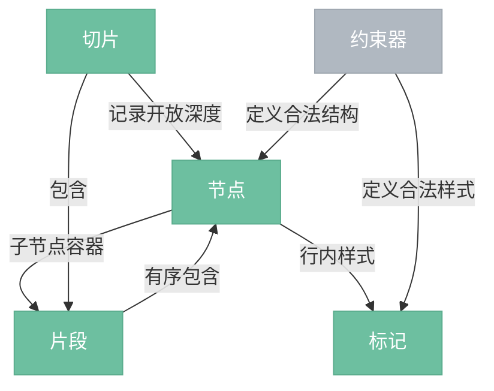

# 文档模型

> 文档的数据表示层，所有内容以不可变节点树的形式存在。节点树是编辑器的核心数据结构，其他所有层围绕它工作。

## 总览



---

## 组件

| 组件 | 说明 |
|------|------|
| 节点 (Node) | 文档树的基本单元，不可变。分为块级节点（段落、标题、代码块等）和行内节点（文本）。每个节点持有一个片段作为子节点容器。 |
| 片段 (Fragment) | 节点子节点的不可变有序序列。所有节点都持有片段（无子节点时为空片段）。修改时返回新实例。 |
| 标记 (Mark) | 叠加在文本节点上的行内样式（粗体、斜体、链接、行内代码等）。多个标记可叠加，顺序由约束器决定。 |
| 切片 (Slice) | 文档的局部片段，边界处的节点可能是"开放"的（不完整的嵌套层级）。用于复制粘贴、拖拽等跨节点操作。 |
| 约束器 (Schema) | 定义文档的合法结构——哪些节点类型存在、允许哪些子节点、哪些标记类型存在、各自的属性。约束所有事务，非法变更自动拒绝或修正。 |

---

## 不可变性

文档模型的所有数据结构都是不可变的。任何修改都通过变换层产生新实例，旧实例保持不变。这带来：

- **撤销/重做**：保留旧状态即可回退
- **安全性**：任意位置可安全引用节点树，不担心被意外修改
- **渲染优化**：未变化的子树可以跳过重绘

---

## 节点树示例

一段 Markdown：

```markdown
# 标题

一段**粗体**文本。
```

对应的节点树：

```
doc
├── heading(level=1)
│   └── text("标题")
└── paragraph
    ├── text("一段")
    ├── text("粗体") [bold]
    └── text("文本。")
```

---

## 位置系统

节点树中的每个可放置光标的位置都有一个整数索引，从 0 开始递增。位置用于选区定位、步骤描述、装饰器定位等。

```
位置:  0  1 2  3  4  5 6 7 8  9 10 11  12
       <h1>标 题</h1><p>一 段 粗 体  文  本  。</p>
```

- 位置从 doc 内部开始计数（位置 0 = doc 的第一个子节点之前）
- doc 自身的开闭标签不计入位置
- 其他块级节点的开标签和闭标签各占 1 个位置
- 文本字符各占 1 个位置
- 文档总大小 = `doc.content.size`
