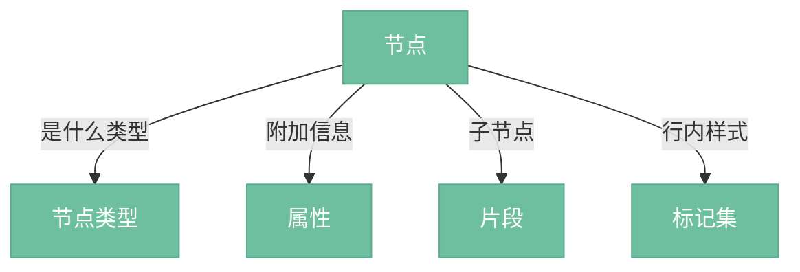

# 节点

> 文档树的基本单元。每个节点是不可变的，持有类型、属性、子节点片段和标记集。

## 节点组成



| 字段 | 类型 | 说明 |
|------|------|------|
| type | NodeType | 节点类型（doc、heading、paragraph、text 等），由约束器定义 |
| attrs | Attrs | 属性键值对（如 heading 的 level、code_block 的 language） |
| content | Fragment | 子节点的有序序列，叶子节点为空片段 |
| marks | Vec\<Mark\> | 仅文本节点使用，叠加的行内样式 |
| text | Option\<String\> | 仅文本节点持有，实际的文字内容 |

### 分类属性

| 属性 | 说明 |
|------|------|
| is_block | 是否是块级节点 |
| is_inline | 是否是行内节点 |
| is_text | 是否是文本节点 |
| is_leaf | 是否是叶子节点（不能有子节点） |
| is_textblock | 是否是包含行内内容的块级节点（如 paragraph、heading） |
| inline_content | 子节点是否为行内内容 |

---

## 节点分类

### 块级节点

纵向排列的"盒子"，构成文档的骨架。

| 节点类型 | 属性 | 子节点 | 对应 Markdown |
|----------|------|--------|---------------|
| doc | — | 块级节点 | 整篇文档 |
| heading | level: 1~6 | 行内内容 | `# ~ ######` |
| paragraph | — | 行内内容 | 普通段落 |
| code_block | language: String | text | ` ``` ` |
| blockquote | — | 块级节点 | `>` |
| bullet_list | — | list_item | `- ` |
| ordered_list | start: u32 | list_item | `1. ` |
| list_item | — | 块级节点 | 列表的每一项 |
| horizontal_rule | — | 无 | `---` |

### 行内节点

块级节点内部的内容。

| 节点类型 | 属性 | 说明 |
|----------|------|------|
| text | — | 文字内容，可携带标记 |
| image | src, alt, title | 行内图片 `` |
| hard_break | — | 强制换行 |

---

## 节点大小

每个节点有两个大小概念：

| 属性 | 说明 |
|------|------|
| node_size | 节点在位置空间中占据的总大小 |
| content.size | 子节点内容的大小（不含自身开闭标签） |

node_size 的计算规则：

| 节点种类 | node_size |
|----------|-----------|
| 文本节点 | 字符数（如 `"标题"` 的 node_size = 2） |
| 叶子节点（非文本） | 1（如 horizontal_rule、hard_break、image） |
| 有子节点的块级节点 | content.size + 2（开闭标签各占 1） |

---

## 关键操作

| 操作 | 说明 |
|------|------|
| node.child(index) | 取第 index 个子节点 |
| node.child_count() | 子节点数量 |
| node.text_content() | 递归拼接所有文本内容 |
| node.text_between(from, to) | 提取范围内的纯文本 |
| node.nodes_between(from, to, f) | 遍历范围内的所有节点，对每个节点调用回调 |
| node.descendants(f) | 递归遍历所有后代节点 |
| node.node_at(pos) | 按位置找到对应的最深层节点 |
| node.resolve(pos) | 解析位置，返回该位置的完整上下文（父节点链、在父节点中的偏移等） |
| node.slice(from, to) | 截取一段切片 |
| node.replace(from, to, slice) | 用切片替换指定范围，返回新节点 |
| node.copy(content) | 创建同类型同属性的节点，但使用新的子内容 |
| node.cut(from, to) | 截取子内容范围，返回同类型新节点 |
| node.can_replace_with(from, to, type) | 检查是否可以用指定类型的节点替换范围 |
| node.same_markup(other) | 类型和属性相同（不比较内容） |
| node.eq(other) | 结构相等比较（递归） |
| node.check() | 验证节点是否符合约束器规则 |

---

## resolve：位置解析

`node.resolve(pos)` 是最常用的操作之一。给定一个整数位置，返回 `ResolvedPos`，包含：

| 字段 | 说明 |
|------|------|
| pos | 原始位置 |
| depth | 嵌套深度（doc = 0） |
| parent() | 当前位置所在的直接父节点 |
| parent_offset | 在父节点 content 中的偏移 |
| node(depth) | 指定深度的祖先节点 |
| index(depth) | 在指定深度的祖先节点中，位于第几个子节点之前 |
| text_offset | 如果在文本节点内部，文本内的字符偏移 |

ResolvedPos 还提供导航方法：

| 方法 | 说明 |
|------|------|
| before(depth) | 指定深度祖先节点之前的位置 |
| after(depth) | 指定深度祖先节点之后的位置 |
| node_after | 当前位置之后紧邻的节点（如果有） |
| node_before | 当前位置之前紧邻的节点（如果有） |
| marks() | 当前位置生效的标记集 |
| shared_depth(pos) | 与另一个位置的最近公共祖先深度 |
| block_range(other) | 与另一个位置之间的块级范围 |

示例——在 `一段**粗体**文本。` 中，resolve 位置 7（"粗"前面）：

```
depth=0: doc          index=1（第 2 个子节点 paragraph 之前）
depth=1: paragraph    index=1（第 2 个子节点 text"粗体" 之前）
parent_offset=2       （paragraph 内部偏移 2，跳过了 "一段"）
```
