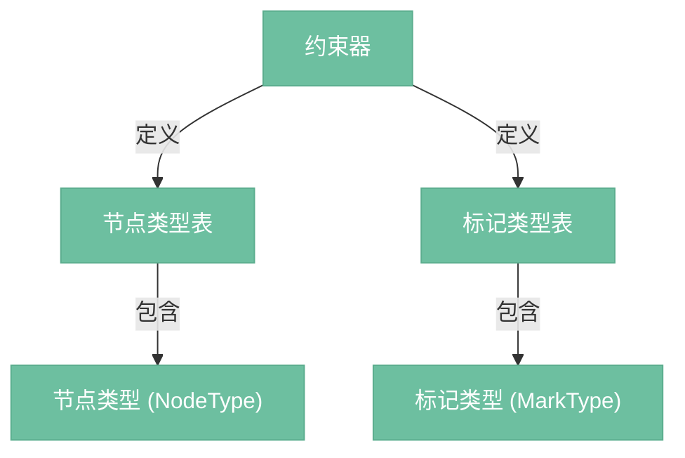

# 约束器

> 定义文档的合法结构——哪些节点类型存在、允许哪些子节点、哪些标记类型存在。编辑器的"规则手册"，所有操作都必须遵守。

## 约束器做什么

没有约束器的话，任何节点可以出现在任何位置：heading 里面嵌 heading、code_block 里面放列表……这些对 Markdown 来说都是非法的。约束器的作用就是在编译期定义规则，在运行时强制执行。

---

## 约束器组成



---

## 节点类型 (NodeType)

每种节点类型描述了"这种节点长什么样、能装什么"。

| 字段 | 说明 |
|------|------|
| name | 类型名（doc、heading、paragraph 等） |
| group | 所属分组（block、inline），用于 content 匹配 |
| content | 子节点规则表达式，描述允许哪些子节点、什么顺序 |
| attrs | 属性定义（名称、默认值） |
| inline | 是否是行内节点 |
| leaf | 是否是叶子节点（不允许有子节点） |
| marks | 允许携带哪些标记（仅对行内内容有效） |

---

## content 表达式

content 字段用类似正则的表达式描述合法的子节点序列：

| 表达式 | 含义 | 示例 |
|--------|------|------|
| `"block+"` | 一个或多个 block 分组的节点 | doc 的子节点 |
| `"inline*"` | 零个或多个 inline 分组的节点 | paragraph、heading 的子节点 |
| `"list_item+"` | 一个或多个 list_item 节点 | bullet_list、ordered_list 的子节点 |
| `"caption?"` | 零个或一个 caption 节点 | 可选子节点 |
| `"(paragraph \| blockquote)+"` | 多种类型选择 | 允许段落或引用 |
| `"paragraph{2,5}"` | 指定数量范围 | 2 到 5 个段落 |
| `""` | 不允许子节点 | horizontal_rule、hard_break、image |
| `"text*"` | 零个或多个文本节点 | code_block（内部只有纯文本，无标记） |

content 表达式在约束器初始化时编译为 **ContentMatch 状态机**，运行时通过状态转移验证子节点序列是否合法。

---

## Markdown 约束器定义

```
doc:          content="block+"
heading:      content="inline*"      attrs={level: 1..6}     group="block"
paragraph:    content="inline*"                              group="block"
code_block:   content="text*"        attrs={language: ""}    group="block"
blockquote:   content="block+"                               group="block"
bullet_list:  content="list_item+"                           group="block"
ordered_list: content="list_item+"   attrs={start: 1}        group="block"
list_item:    content="block+"                               group="block"
horizontal_rule:  content=""         leaf=true                group="block"

text:         inline=true                                    group="inline"
image:        content=""  leaf=true  attrs={src,alt,title}   group="inline"
hard_break:   content=""  leaf=true  inline=true             group="inline"

标记类型:
bold:          {}
italic:        {}
code:          {}        excludes="bold italic link strikethrough"
link:          {href, title}
strikethrough: {}
```

---

## 标记排斥

某些标记不能共存。典型的例子是行内代码 `code`——行内代码里面不应该有粗体、斜体、链接等样式。

通过标记类型的 `excludes` 字段定义：

```
code 的 excludes = "bold italic link strikethrough"

所以 text("内容")[code, bold] 是非法的 → 约束器会拒绝
```

---

## 约束检查时机

约束器不是事后检查，而是融入操作过程中：

| 时机 | 说明 |
|------|------|
| 替换步骤应用时 | 检查替换结果是否产生合法的子节点序列 |
| 添加标记步骤时 | 检查目标节点是否允许该标记 |
| 粘贴时 | 切片融入目标位置前，根据目标节点的 content 规则调整切片内容 |
| 设置块类型时 | 检查新类型在父节点中是否合法 |

非法操作不会静默失败——要么拒绝，要么自动修正（如粘贴时去掉不合法的标记）。

---

## ContentMatch

content 表达式编译后的产物。本质是一个有限状态机，用于逐个验证子节点是否合法。

| 方法 | 说明 |
|------|------|
| match_type(node_type) | 尝试匹配一个节点类型，返回下一个状态（None 表示不合法） |
| match_fragment(fragment) | 尝试匹配整个片段 |
| fill_before(after, to_end) | 生成使当前状态能接上 after 片段所需的填充节点（粘贴时自动补全用） |
| valid_end | 当前状态是否可以作为结束（子节点序列是否完整） |

`fill_before` 是粘贴操作的关键——当切片融入目标位置时，如果缺少必需的子节点，ContentMatch 会自动生成空的默认节点来填充。

---

## 约束器工厂方法

约束器是创建节点和标记的唯一入口：

| 方法 | 说明 |
|------|------|
| schema.node(type, attrs, content, marks) | 创建节点 |
| schema.text(text, marks) | 创建文本节点 |
| schema.mark(type, attrs) | 创建标记 |
| schema.top_node_type | 顶层节点类型（doc） |

所有节点必须通过约束器创建，确保类型和属性合法。
