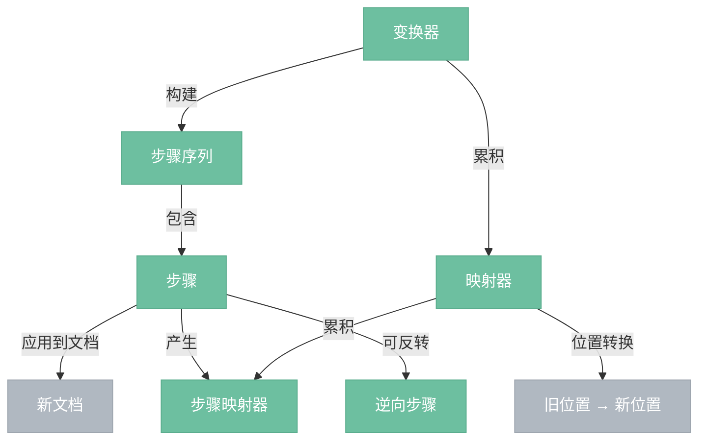

# 变换层

> 对文档的所有修改都通过变换层进行。变换层将修改分解为原子步骤，每个步骤可以被应用、反转、映射，使撤销和协同编辑成为可能。

## 总览



---

## 为什么需要变换层

直接修改文档（比如"把位置 5 到 7 的内容删掉"）可以做到，但如果只保存最终结果，就丢失了"怎么改的"信息。

变换层把每次修改记录为步骤序列：

```
步骤1: 删除位置 5~7
步骤2: 在位置 5 插入 "新文字"
步骤3: 给位置 5~8 添加 bold 标记
```

有了步骤序列就能：
- **撤销**：反转步骤，倒着应用
- **协同编辑**：把步骤发给其他客户端重放
- **位置追踪**：通过步骤映射器知道"原来的位置 10 现在变成了几"

---

## 组件

| 组件 | 说明 |
|------|------|
| 步骤 (Step) | 对文档的最小原子操作。可以被应用到文档产生新文档，也可以反转产生逆向步骤。 |
| 步骤结果 (StepResult) | 步骤应用的结果——成功时包含新文档，失败时包含错误信息。 |
| 步骤映射器 (StepMap) | 单个步骤产生的位置映射，描述文档变更前后位置的对应关系。 |
| 映射器 (Mapping) | 多个步骤映射器的累积，用于将位置映射经过一系列步骤。 |
| 变换器 (Transform) | 步骤序列的构建器，提供高层操作方法（替换、添加标记、拆分节点等），内部分解为步骤。 |

---

## 步骤类型

| 步骤类型 | 说明 |
|----------|------|
| ReplaceStep | 用切片替换文档中的一个范围。最基础的步骤，插入、删除、替换都是它。 |
| ReplaceAroundStep | 替换范围的"外壳"但保留中间内容。用于包裹（wrap）和提升（lift）操作。 |
| AddMarkStep | 给指定范围的行内内容添加标记。 |
| RemoveMarkStep | 从指定范围的行内内容移除标记。 |
| AddNodeMarkStep | 给指定位置的单个节点添加标记。 |
| RemoveNodeMarkStep | 从指定位置的单个节点移除标记。 |
| AttrStep | 修改指定位置节点的属性（如修改 heading 的 level）。 |

### ReplaceStep 示例

```
删除 "一段" 二字:
  ReplaceStep(from=5, to=7, slice=Slice::empty())

插入文字:
  ReplaceStep(from=5, to=5, slice=Slice(Fragment[text("新文字")], 0, 0))

替换:
  ReplaceStep(from=5, to=7, slice=Slice(Fragment[text("新文字")], 0, 0))
```

### ReplaceAroundStep 示例

```
把 paragraph 包裹进 blockquote:

  原始:  doc > paragraph("内容")
  目标:  doc > blockquote > paragraph("内容")

  ReplaceAroundStep:
    在 paragraph 外面插入 blockquote 的开闭标签
    中间的 paragraph 内容保持不动
```

---

## 步骤的生命周期

```
1. 构造步骤
     ↓
2. step.apply(doc) → StepResult
     ↓ 成功
3. 得到新文档 + step.get_map() 得到步骤映射器
     ↓
4. step.invert(doc) → 逆向步骤（用于撤销）
```

步骤应用可能失败（比如替换后违反约束器规则），此时 StepResult 包含错误信息而不是新文档。

---

## 位置映射

文档每次修改后，之前的位置可能失效。步骤映射器和映射器解决这个问题。

### 步骤映射器 (StepMap)

单个步骤的位置映射。内部记录了一组 (旧位置, 旧长度, 新长度) 三元组：

```
删除位置 4~6（2 个字符）:
  StepMap: (4, 2, 0)

  位置 3 → 3     （删除区域之前，不变）
  位置 5 → 4     （在删除区域内，映射到删除点）
  位置 8 → 6     （删除区域之后，减 2）
```

### 映射偏向 (bias)

当位置恰好在插入点时，往左还是往右？

```
在位置 5 插入 3 个字符:
  StepMap: (5, 0, 3)

  map(5, bias=1)  → 8    （默认，跟着插入内容走到右边）
  map(5, bias=-1) → 5    （留在插入点左边）
```

偏向在光标处理中很重要——输入文字时光标应该跟着文字走（bias=1），但段落开头的标记不应该被推走（bias=-1）。

### 映射器 (Mapping)

多个步骤映射器的累积。变换器自动维护：

```
步骤1: 删除位置 4~6       → StepMap1
步骤2: 在位置 4 插入 "新"  → StepMap2

Mapping = [StepMap1, StepMap2]

mapping.map(8)  先经过 StepMap1 → 6，再经过 StepMap2 → 7
```

---

## 变换器 (Transform)

变换器是步骤序列的高层构建器。你不需要手动构造步骤，而是调用变换器的方法：

| 方法 | 说明 |
|------|------|
| tr.replace(from, to, slice) | 用切片替换范围 |
| tr.replace_with(from, to, node) | 用节点替换范围 |
| tr.delete(from, to) | 删除范围 |
| tr.insert(pos, node) | 在位置插入节点 |
| tr.add_mark(from, to, mark) | 给范围添加标记 |
| tr.remove_mark(from, to, mark) | 从范围移除标记 |
| tr.clear_incompatible(pos, type) | 清除与目标类型不兼容的标记 |
| tr.set_node_markup(pos, type, attrs, marks) | 修改节点类型/属性/标记 |
| tr.set_node_attribute(pos, attr, value) | 修改节点的单个属性 |
| tr.split(pos, depth) | 在位置拆分节点（回车换行） |
| tr.join(pos) | 合并相邻节点（在段落开头按退格） |
| tr.lift(range, target) | 把节点从父节点中提升一级（取消列表嵌套） |
| tr.wrap(range, wrappers) | 用新节点包裹范围（缩进为列表项、包进引用块） |

每个方法内部：
1. 构造对应的步骤
2. 应用步骤得到新文档
3. 步骤映射器加入映射器
4. 返回 self（支持链式调用）

### 链式调用示例

```
tr.delete(5, 7)
  .insert(5, schema.text("新文字"))
  .add_mark(5, 8, schema.mark("bold"))
```

三个操作产生三个步骤，位置在每一步之间自动通过映射器转换。

---

## 与其他层的关系

| 方向 | 说明 |
|------|------|
| 变换层 → 文档模型层 | 步骤应用到节点树产生新节点树 |
| 状态层 → 变换层 | 事务 (Transaction) 继承自变换器，在步骤序列之上追踪选区和元数据 |
| 插件层 → 变换层 | 历史插件利用步骤反转实现撤销 |
