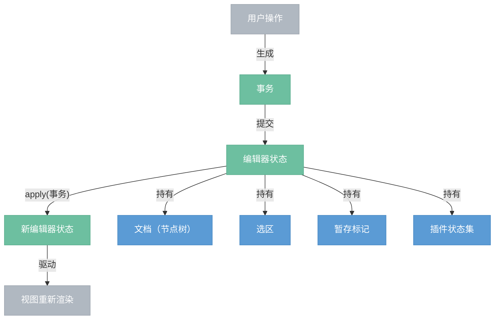

# 状态层

> 编辑器的完整状态快照。持有文档、选区、暂存标记和插件状态，通过事务进行更新。每次更新产生新状态实例，旧状态不变。

## 总览



---

## 组件

| 组件 | 说明 |
|------|------|
| 编辑器状态 (EditorState) | 编辑器某一时刻的完整快照。不可变，每次更新产生新实例。 |
| 事务 (Transaction) | 继承自变换器，在步骤序列之上追踪选区变化、暂存标记和元数据。是状态更新的唯一途径。 |
| 选区 (Selection) | 描述光标或选区的位置。分为文本选区、节点选区、间隙光标。 |

---

## 状态更新流程

所有修改都必须通过事务，没有例外：

```
1. 从当前状态创建事务:     let tr = state.tr()
2. 在事务上执行操作:       tr.delete(4, 6).insert(4, node)
3. 提交事务得到新状态:     let new_state = state.apply(tr)
4. 新状态驱动视图重渲染
```

**为什么不能直接修改状态？**

- 直接修改会产生无效的中间状态（文档改了但选区还是旧的）
- 插件无法感知变更
- 无法记录变更历史

事务把"文档修改 + 选区更新 + 元数据"打包成一个原子操作，apply 一次性产生完整的新状态。

---

## 编辑器状态 (EditorState)

| 字段 | 说明 |
|------|------|
| doc | 当前文档（节点树） |
| selection | 当前选区 |
| stored_marks | 暂存标记——用户激活了粗体但还没输入文字时，粗体标记暂存在这里 |
| schema | 约束器引用 |
| plugins | 插件列表 |

| 方法 | 说明 |
|------|------|
| EditorState::create(schema, doc, selection, plugins) | 创建初始状态 |
| state.tr() | 创建一个基于当前状态的事务 |
| state.apply(tr) → EditorState | 应用事务，返回新状态 |

### apply 内部流程

```
state.apply(tr):
  1. 新文档 = tr.doc（事务中步骤应用后的最终文档）
  2. 新选区 = tr 中设置的选区，或将旧选区通过 tr.mapping 映射到新位置
  3. 新暂存标记 = tr 中设置的暂存标记，或在选区/文档变化后清除
  4. 新插件状态 = 各插件的 apply(tr, old_plugin_state) 返回值
  5. 返回新的 EditorState
```

---

## 暂存标记 (Stored Marks)

用户按下 Ctrl+B 激活粗体，光标处还没有文字——这个"粗体已激活"的状态就存在暂存标记里。

```
场景: 光标在普通文本中，用户按 Ctrl+B

1. 事务: tr.set_stored_marks([bold])
2. 新状态的 stored_marks = [bold]
3. 用户输入 "a"
4. 视图发现 stored_marks 中有 bold → 创建 text("a")[bold]
5. 输入后 stored_marks 自动清除
```

暂存标记在以下情况自动清除：
- 文档发生变化（输入了文字，标记已经应用上去了）
- 选区发生移动（用户移走了光标，表示不打算在此处输入了）

---

## 与其他层的关系

| 方向 | 说明 |
|------|------|
| 状态层 ← 变换层 | 事务继承自变换器，复用步骤、映射等全部能力 |
| 状态层 → 视图层 | 新状态驱动视图重新渲染 |
| 状态层 ← 视图层 | 用户操作通过视图生成事务，提交回状态层 |
| 状态层 ↔ 插件层 | 状态持有插件状态，事务触发插件更新 |
