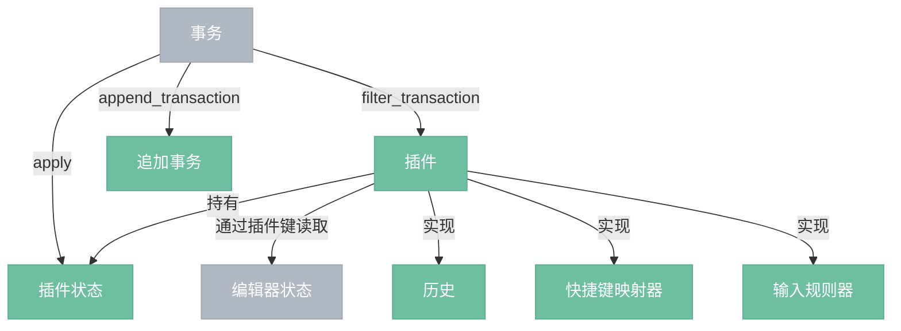

# 插件层

> 可插拔的功能扩展机制。插件可以持有独立状态、拦截事务、提供装饰、响应键盘输入。核心功能（历史、快捷键、输入规则）都以插件形式实现。

## 总览



---

## 组件

| 组件 | 说明 |
|------|------|
| 插件 (Plugin) | 可插拔的功能单元，定义状态字段、事务拦截、视图行为扩展。 |
| 插件键 (PluginKey) | 插件的唯一标识，用于从编辑器状态中读取插件状态、在事务元数据中通信。 |
| 历史 (History) | 撤销/重做。记录事务的逆向步骤。 |
| 快捷键映射器 (Keymap) | 将键盘事件映射为命令函数。 |
| 输入规则器 (InputRules) | 监听文本输入模式，匹配时触发事务。 |

---

## 插件结构

一个插件由以下部分组成（均为可选）：

| 部分 | 说明 |
|------|------|
| key | 插件键，用于从状态中读取插件状态 |
| state.init() | 初始化插件状态 |
| state.apply(tr, value, old_state, new_state) | 事务提交后更新插件状态，返回新值 |
| filter_transaction(tr, state) → bool | 在事务应用前拦截，返回 false 可阻止事务 |
| append_transaction(tr, old_state, new_state) → Option\<Transaction\> | 事务应用后追加额外事务（如自动修正） |
| props | 视图层的行为扩展（事件处理、装饰器提供等） |

---

## 插件状态

插件状态是不可变的。apply 方法接收事务和旧值，返回新值：

```
// 示例: 一个字数统计插件
state:
  init(state):
    return count_words(state.doc)

  apply(tr, word_count, old_state, new_state):
    if tr.doc_changed:
      return count_words(new_state.doc)
    else:
      return word_count  // 文档没变，字数不变
```

从编辑器状态中读取插件状态：

```
let word_count = word_count_key.get_state(&editor_state);
```

---

## 事务拦截

### filter_transaction

在事务应用之前调用。可以阻止不想要的事务：

```
// 示例: 只读模式插件
filter_transaction(tr, state):
  if tr.doc_changed:
    return false  // 阻止所有文档修改
  return true
```

### append_transaction

在事务应用之后调用。可以追加额外的事务来做自动修正：

```
// 示例: 自动修正标题层级（不允许跳级）
append_transaction(tr, old_state, new_state):
  if 检测到标题层级跳跃:
    let fix_tr = new_state.tr()
    fix_tr.set_node_attribute(pos, "level", corrected_level)
    return Some(fix_tr)
  return None
```

---

## 插件执行顺序

多个插件按注册顺序执行：

```
EditorState::create(schema, doc, [plugin_a, plugin_b, plugin_c])
```

- **filter_transaction**：按顺序执行，任何一个返回 false 即阻止事务
- **state.apply**：按顺序执行，每个插件看到同一个事务
- **append_transaction**：按顺序执行，追加的事务会再次触发所有插件的 apply

---

## 与其他层的关系

| 方向 | 说明 |
|------|------|
| 插件层 ← 状态层 | 编辑器状态持有插件列表和插件状态，事务触发插件更新 |
| 插件层 → 变换层 | 历史插件利用步骤反转实现撤销 |
| 插件层 → 视图层 | 插件可通过 props 提供装饰器、事件处理等 |
