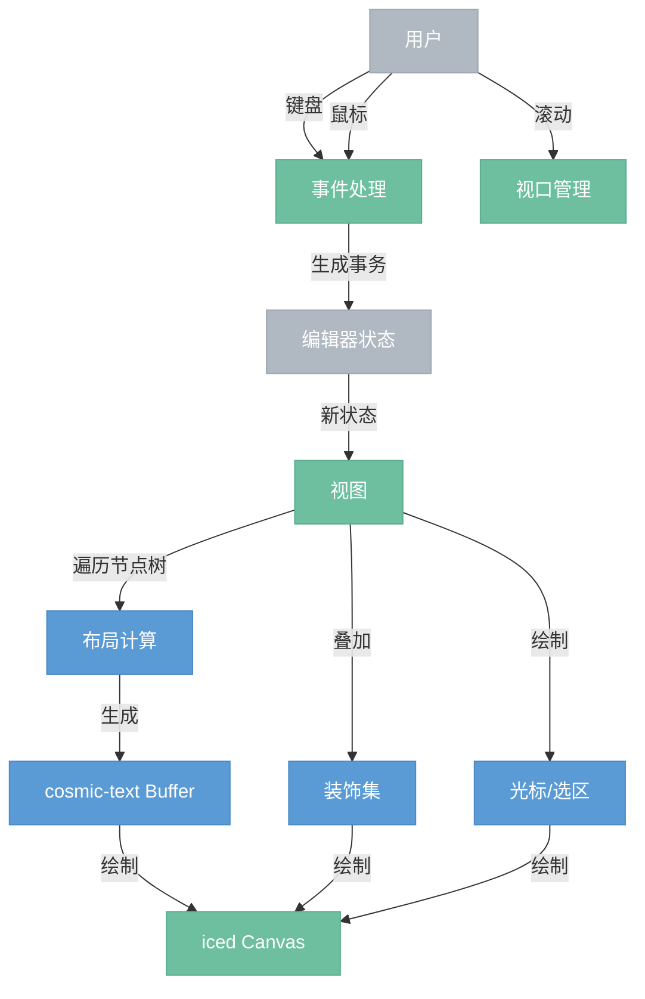

# 视图层

> 将编辑器状态渲染为可视界面，将用户操作转化为事务。本项目采用单个 iced Canvas + cosmic-text 方案，不使用 iced widget 树。

## 总览



---

## 组件

| 组件 | 说明 |
|------|------|
| 视图 (View) | 顶层协调者。持有编辑器状态，处理事件，驱动渲染。对应 iced 的一个 Canvas widget。 |
| 装饰器 (Decoration) | 不修改文档的纯视觉叠加（高亮、图标、背景色等）。 |
| 装饰集 (DecorationSet) | 装饰器的持久化集合，镜像文档树结构以便高效更新。 |

---

## 渲染策略

> **核心决策**：不使用 iced widget 树。节点树已经描述了完整的文档结构，再转换为 widget 树是多余的中间表示。

### 渲染流程

```
1. 编辑器状态更新
     ↓
2. 遍历节点树，对每个节点:
   - 块级节点: 计算 y 坐标、高度、缩进、背景
   - 文本节点: 写入 cosmic-text Buffer，设置字体/大小/颜色/标记样式
     ↓
3. cosmic-text 排版（换行、字体回退、字形定位）
     ↓
4. 视口裁剪: 只绘制可见区域 ± 缓冲区的内容
     ↓
5. 在 iced Canvas 上绘制:
   - 块级背景（代码块灰底、引用块左边条等）
   - 文本内容
   - 选区高亮
   - 光标
   - 装饰器
```

### 块级节点的视觉处理

| 节点类型 | 视觉效果 |
|----------|---------|
| heading | 更大的字号、加粗字体、上下额外间距 |
| paragraph | 标准字号、段间距 |
| code_block | 灰色背景、等宽字体、内边距 |
| blockquote | 左侧竖条、左缩进 |
| bullet_list / ordered_list | 左缩进、列表符号/编号 |
| horizontal_rule | 水平细线 |
| image | 加载并绘制图片 |

### 行内标记的视觉处理

| 标记 | cosmic-text 样式 |
|------|-----------------|
| bold | 粗体字重 |
| italic | 斜体 |
| code | 等宽字体、灰色背景 |
| link | 蓝色、下划线 |
| strikethrough | 删除线 |

---

## 事件处理

视图将用户操作翻译为事务：

### 键盘事件

```
键盘事件
  ↓
1. 先交给快捷键映射器: 匹配到命令 → 生成事务 → 完成
  ↓ 未匹配
2. 普通文字输入: 交给输入规则器检查模式
  ↓ 未匹配规则
3. 直接插入文字: replace_selection_with(schema.text(char, stored_marks))
```

### 鼠标事件

| 事件 | 处理 |
|------|------|
| 点击 | cosmic-text hit test → 文档位置 → 设置光标选区 |
| 拖选 | 记录 anchor，持续 hit test 更新 head → 文本选区 |
| 双击 | 选中单词（根据 Unicode 分词） |
| 三击 | 选中整个块级节点 |
| Ctrl+点击 | 节点选区（选中整个节点） |

### 坐标转换

| 方法 | 说明 |
|------|------|
| pos_at_coords(x, y) | 屏幕坐标 → 文档位置。通过 cosmic-text 的 hit test 实现。 |
| coords_at_pos(pos) | 文档位置 → 屏幕坐标。通过 cosmic-text 的字形位置查询实现。 |

这两个方法是鼠标交互和弹出菜单定位的基础。

---

## 视口管理

大文档不需要全部渲染，只渲染可见区域：

```
视口 = 用户可见的矩形区域（scroll_y ~ scroll_y + viewport_height）

渲染范围 = 视口 ± 缓冲区（上下各多渲染一屏，避免滚动时白屏）

遍历节点树时:
  if 节点的 y + height < 渲染范围上界: 跳过
  if 节点的 y > 渲染范围下界: 停止
```

滚动时只需要更新 scroll_y，重新绘制 Canvas。缓冲区内的内容已经准备好了，用户感知不到延迟。

---

## 更新优化

不是每次状态更新都要重新渲染整个文档：

| 变化类型 | 优化策略 |
|----------|---------|
| 纯选区变化（无文档修改） | 只重绘光标和选区，文本不变 |
| 局部文本修改 | 只重排受影响的块级节点的 cosmic-text Buffer |
| 块级结构变化 | 从变化点开始重新计算后续块级节点的 y 坐标 |
| 属性变化（如标题级别） | 只重绘该节点 |

---

## 与其他层的关系

| 方向 | 说明 |
|------|------|
| 视图 ← 状态层 | 新状态驱动视图重新渲染 |
| 视图 → 状态层 | 用户操作生成事务提交回状态层 |
| 视图 ← 插件层 | 插件通过 props 提供装饰器、事件处理扩展 |
| 视图 ← 文档模型层 | 遍历节点树获取内容和结构信息 |
